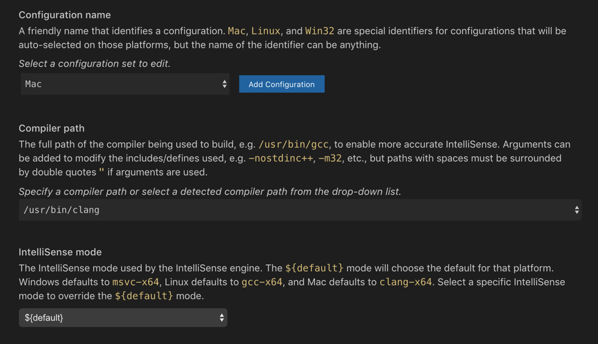
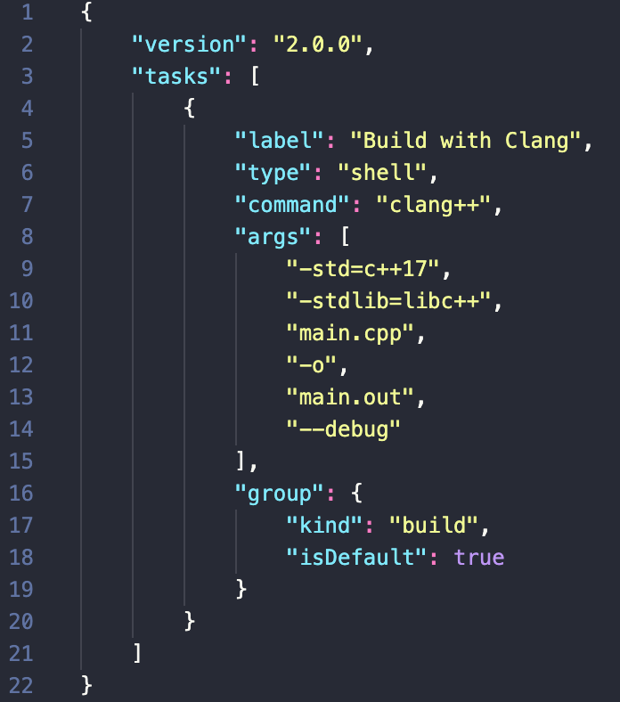
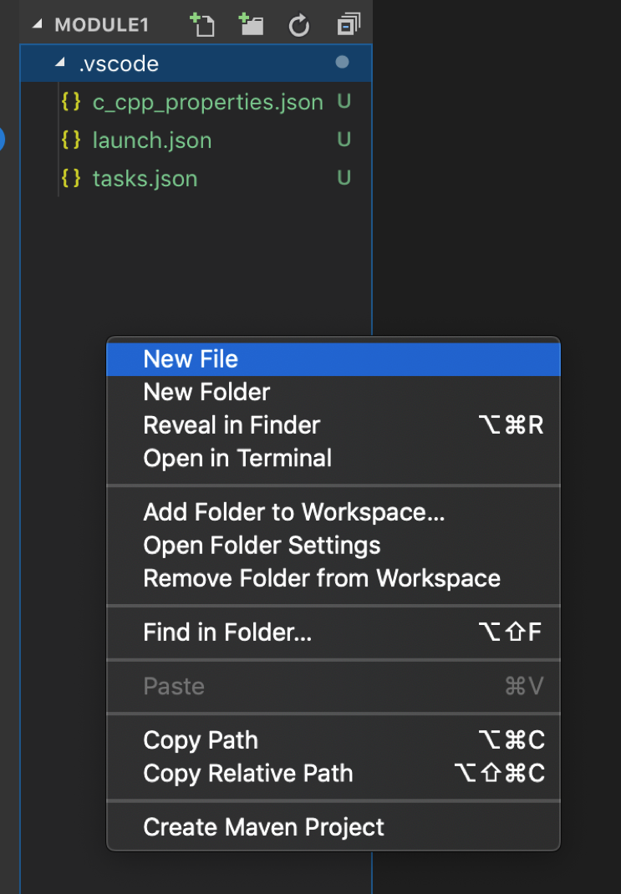
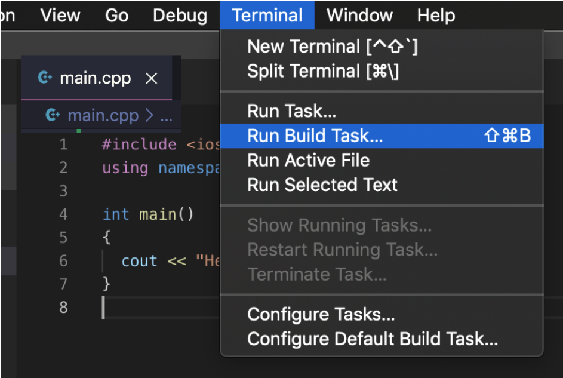
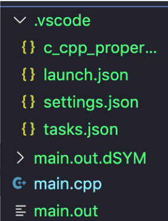

# MacOS C++ Project Setup in VS Code

# Table of Contents
- [Initial Setup](https://github.com/clarkngo/cpp-projects/tree/master/cpp_project_setup/mac#initial-setup)
  - [Installing C++ extension for VS Code](https://github.com/clarkngo/cpp-projects/tree/master/cpp_project_setup/mac#installing-c-extension-for-vs-code)
  - [Working in the project folder](https://github.com/clarkngo/cpp-projects/tree/master/cpp_project_setup/mac#working-in-the-project-folder)
  - [For MacOS users](https://github.com/clarkngo/cpp-projects/tree/master/cpp_project_setup/mac#for-macos-users)
  - [Our first Hello](https://github.com/clarkngo/cpp-projects/tree/master/cpp_project_setup/mac#our-first-hello)
- [Workflow](https://github.com/clarkngo/cpp-projects/tree/master/cpp_project_setup/mac#workflow)
  - [Step by step]
- [Contents of the Files](https://github.com/clarkngo/cpp-projects/tree/master/cpp_project_setup/mac#contents-of-the-files)
  - [`c_cpp_properties.json`]()
  - [`launch.json`]()
  - [`settings.json`]()
  - [`tasks.json`]()
- Modifying for Project Use with Header and Source and Implementation files

## Initial Setup
### Installing C++ extension for VS Code
1)	Open your VS Code. On the left side bar, click Extensions Icon. A search field will pop up, type c++ in the search field then hit Enter. A list will populate below the search field. Click C/C++ then a description on the right will appear. Click Install.


### Working in the project folder

1)	Open VS Code.


2)	Go to the project folder: CS555_FALL_2019/IN/FirstnameLastname/

If you are an online student:
Open CS555_Fall_2019/ON/FirstnameLastname. ( File > Open )

If you are an onsite student:
Open CS555_Fall_2019/IN/FirstnameLastname. ( File > Open )

3)	Create a folder Module1 and go inside that folder.
```
mkdir Module1
cd Module1
```


1)	Go to CS555_FALL_2019/yourfirstname-lastname/Module1. Open your VS Code with Module1 project folder. You can use the command below or open the folder using Step 2.
```
code .
```

### For MacOS users

Full installation reference: https://code.visualstudio.com/docs/cpp/config-clang-mac

1)	Open your VS Code.
2)	Click Open Folder.

If you are an online student:
Open CS555_Fall_2019/ON/Yourname/Module1. ( File > Open )

If you are an onsite student:
Open CS555_Fall_2019/IN/Yourname/Module1. ( File > Open )

3)	Configure the compiler path. Press ⇧⌘P to open the Command Palette. It looks like this:


4)	Start typing "C/C++" and then choose Edit Configurations (UI) from the list of suggestions.

5)	Make sure Configuration Name is set to Mac. Compiler path is set to /usr/bin/clang. Intellisense mode set to ${default}.



6)	This should create a c_cpp_properties.json file. If not, feel free to create and copy. [Copy the code here](https://github.com/clarkngo/cpp-projects/blob/master/cpp_project_setup/mac/.vscode/c_cpp_properties.json)


7)	Create the file launch.json and add the following code: [Copy the code here](https://github.com/clarkngo/cpp-projects/blob/master/cpp_project_setup/mac/.vscode/launch.json)


8)	Create the file tasks.json and add the following code: [Copy the code here](https://github.com/clarkngo/cpp-projects/blob/master/cpp_project_setup/mac/.vscode/tasks.json)



9)	You should have this project directory:


### Our first Hello

1)	Create a new file by right clicking anywhere below the files.



2)	Create a `main.cpp` file. Please add the following code:


3)	In the VS Code menu, click Terminal > Run Build Task.



You should see this output:


Click anywhere in the terminal to close the message.

New files will be created.



4)	Run the compiled c++ file (.out)

```
./main.out
```


## Workflow

1 -	Copy .vscode and add to your project folder

## Step by Step
- Click `.vscode.zip`
- Click Download
- Choose the location of your project folder

Sample working C++ project directory structure
```
| hello
|_ .vscode
 |_ c_cpp_properties.json
 |_ launch.json
 |_ settings.json
 |_ tasks.json
|_ main.cpp
```

Note: You have to have `.vscode` folder and files in every C++ project folder.

- In `tasks.json`:
```
            "args": [
                "-std=c++17",
                "-stdlib=libc++",
                "main.cpp",
                "-o",
                "main.out",
                "--debug"
```

## Contents of the Files

The following files are included in .vscode:

### `c_cpp_properties.json`

```
{
    "configurations": [
        {
            "name": "Mac",
            "includePath": [
                "${workspaceFolder}/**"
            ],
            "defines": [],
            "macFrameworkPath": [],
            "compilerPath": "/usr/bin/clang",
            "cStandard": "c11",
            "cppStandard": "c++17",
            "intelliSenseMode": "${default}"
        }
    ],
    "version": 4
}
```

### `launch.json`

```
{
    "version": "0.2.0",
    "configurations": [
        {
            "name": "(lldb) Launch",
            "type": "cppdbg",
            "request": "launch",
            "program": "${workspaceFolder}/main.out",
            "args": [],
            "stopAtEntry": true,
            "cwd": "${workspaceFolder}",
            "environment": [],
            "externalConsole": true,
            "MIMode": "lldb",
            "logging": {
                "trace": true,
                "traceResponse": true,
                "engineLogging": true
            }
        }
    ]
  }
```

### `settings.json`

```
{
  "files.associations": {
    "*.html": "html",
    "ostream": "cpp"
  }
}
```

### `tasks.json`

```
{
    "version": "2.0.0",
    "tasks": [
        {
            "label": "Build with Clang",
            "type": "shell",
            "command": "clang++",
            "args": [
                "-std=c++17",
                "-stdlib=libc++",
                "main.cpp",
                "-o",
                "main.out",
                "--debug"
            ],
            "group": {
                "kind": "build",
                "isDefault": true
            }
        }
    ]
}
```
