# Windows C++ Project Setup in VS Code
## Initial Setup
### Installing C++ extension for VS Code
1)	Open your VS Code. On the left side bar, click Extensions Icon. A search field will pop up, type c++ in the search field then hit Enter. A list will populate below the search field. Click C/C++ then a description on the right will appear. Click Install.

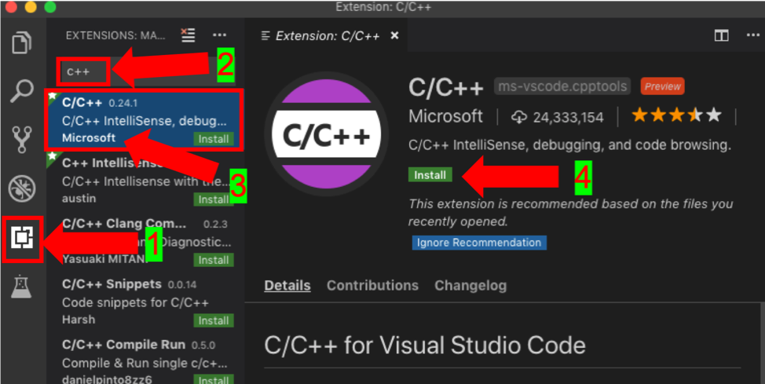

Working in the project folder

1)	Open VS Code.

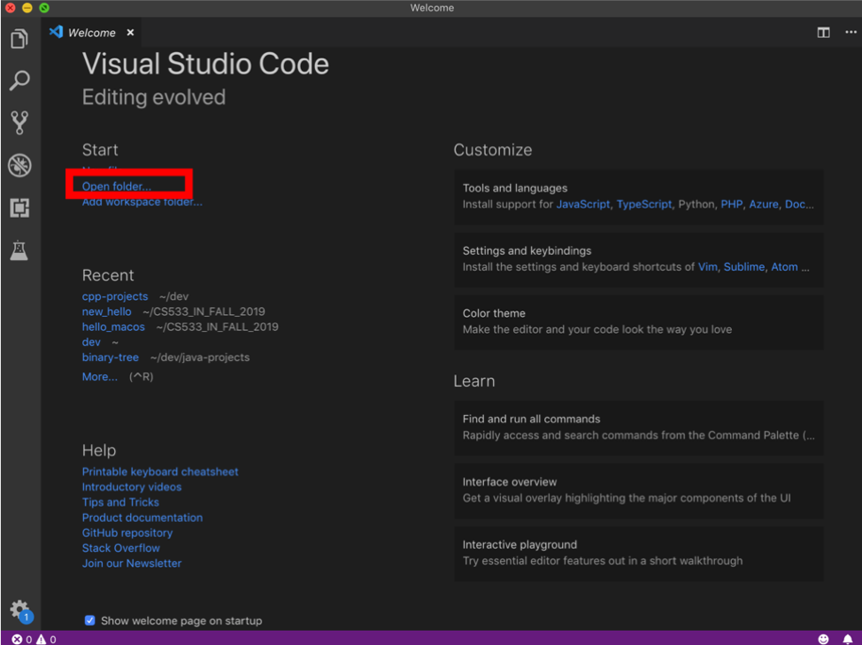

2)	Go to the project folder: CS555_FALL_2019/IN/FirstnameLastname/

If you are an online student:
Open CS555_Fall_2019/ON/FirstnameLastname. ( File > Open )

If you are an onsite student:
Open CS555_Fall_2019/IN/FirstnameLastname. ( File > Open )

3)	Create a folder Module1 and go inside that folder.
```
mkdir Module1
cd Module1
```
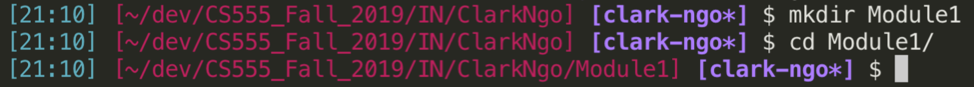

1)	Go to CS555_FALL_2019/yourfirstname-lastname/Module1. Open your VS Code with Module1 project folder. You can use the command below or open the folder using Step 2.
```
code .
```
### For Windows users

Full installation reference: https://code.visualstudio.com/docs/cpp/config-mingw

1)	Go to mingw-w64 link: http://mingw-w64.org/doku.php/download/mingw-builds.

2)	Click Sourceforge.

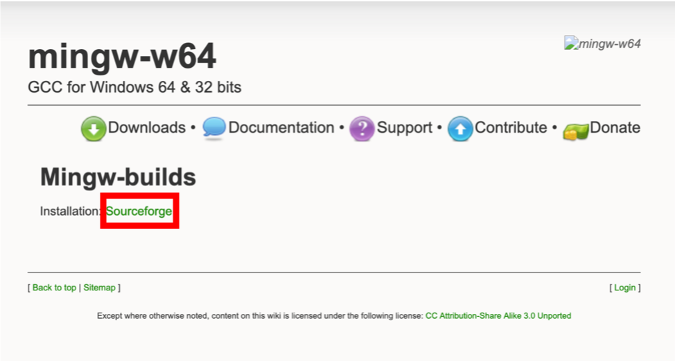

3)	Run the installation.

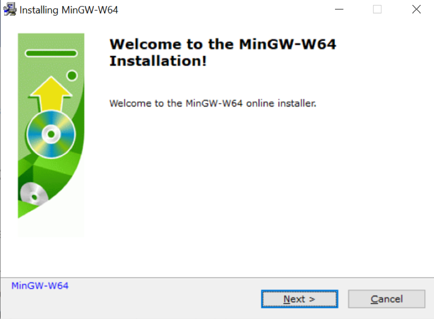

4)	Click Next.

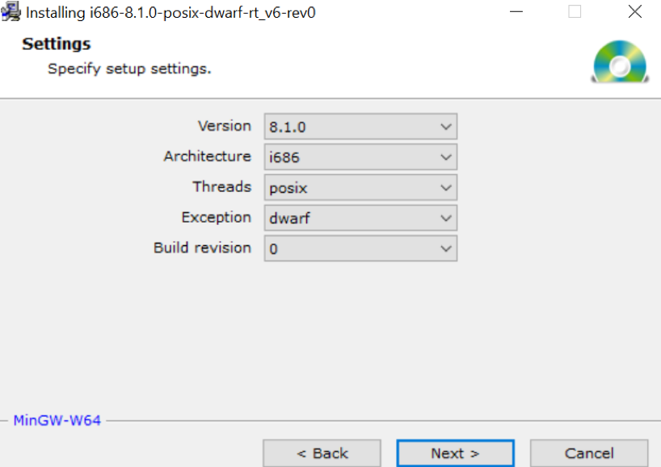

5)	The default path would be generated by the installation wizard. We have to edit the Destination Folder and delete Program Files (x86)\.

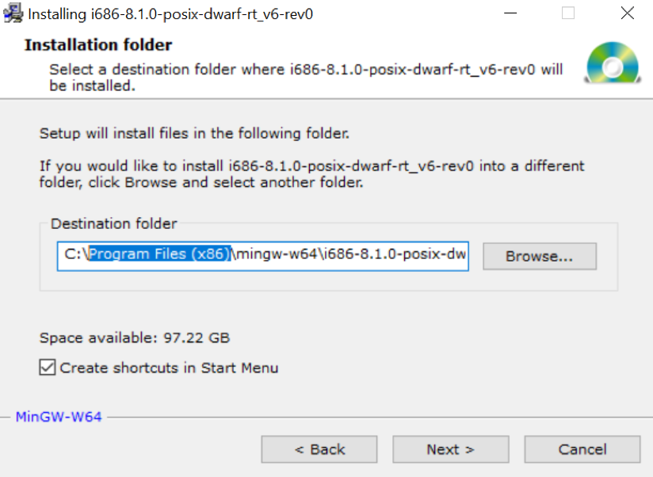

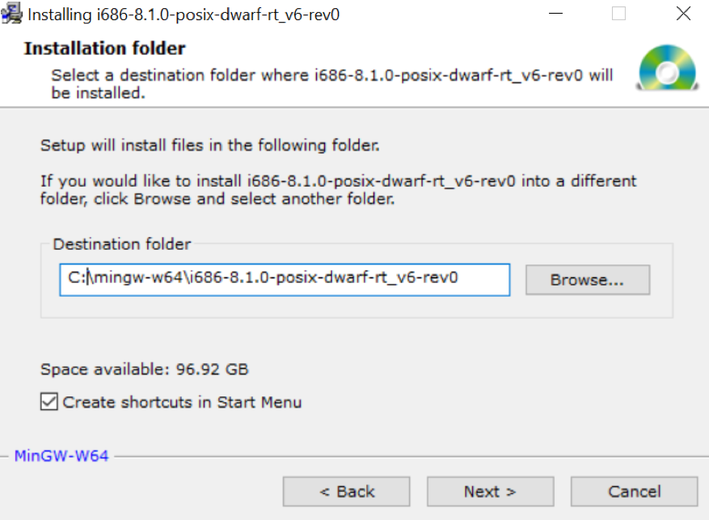

6)	Click Finish.

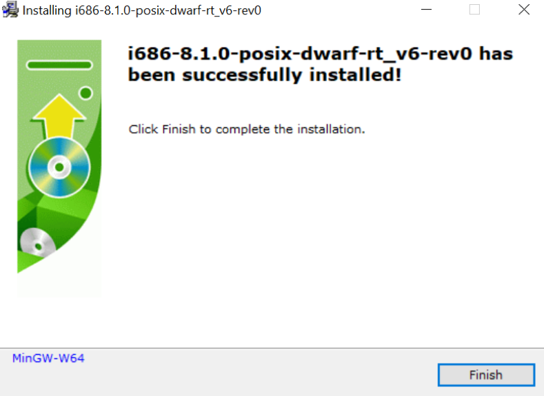

7)	Locate your compiler. Got to This PC > Local Disk (C:) > mingw-w64 > i686-8.1.0-posix-dwarf-rt_v6-rev0 > mingw32 > bin

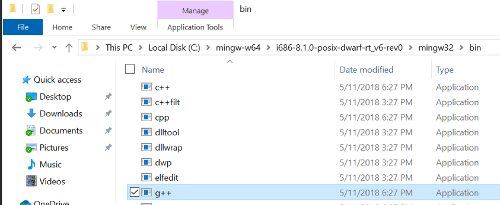

8)	Right click on bin in the address bar and choose Copy Address.

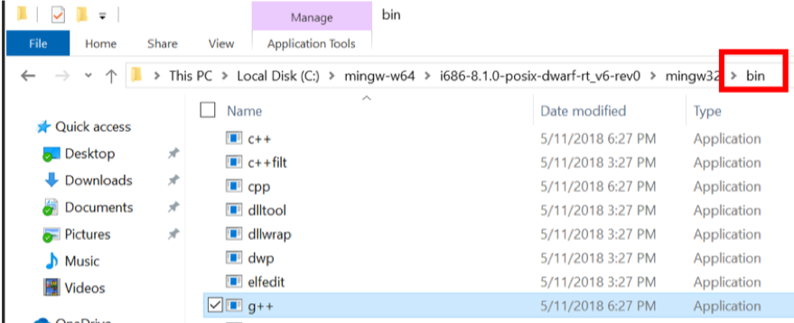

9)	Find Edit system environment variables

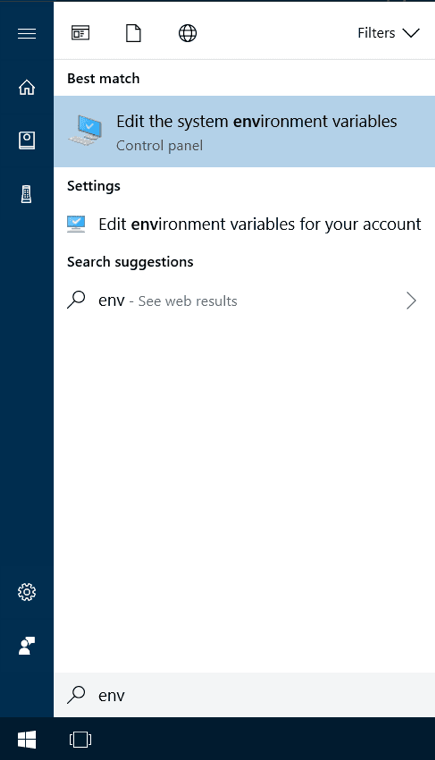

10)	Under user variables, click Path and click Edit…

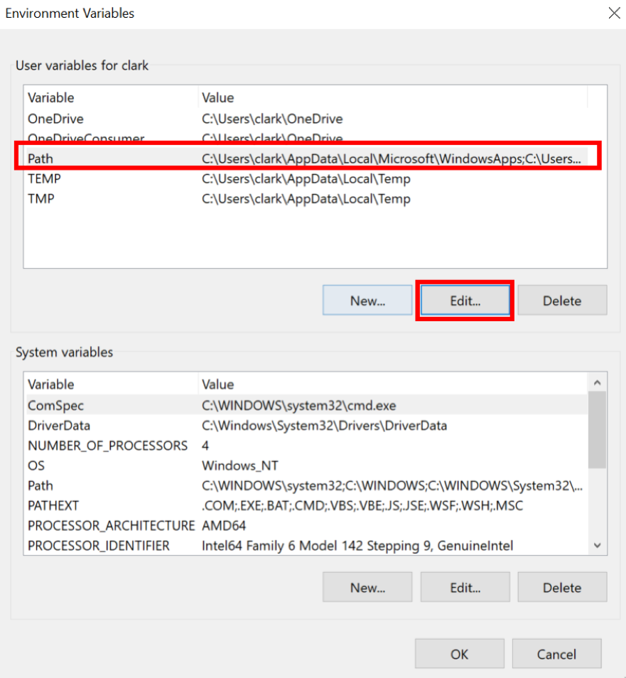

11)	Click New and add the path of your compiler. You should have a similar output as below.

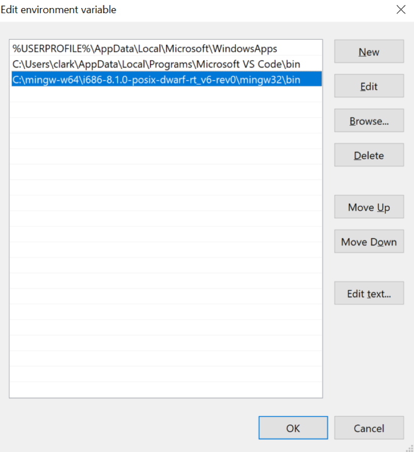

Open VS Code

1)	Open your VS Code.
2)	Click Open Folder.

If you are an online student:
Open CS555_Fall_2019/ON/Yourname/Module1. ( File > Open )

If you are an onsite student:
Open CS555_Fall_2019/IN/Yourname/Module1. ( File > Open )

### Our first Hello

1)	Create a new file by right clicking anywhere below the files.


2)	Create a hello.cpp file. Please add the following code:

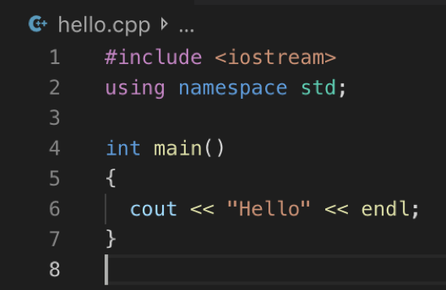

3)	In the VS Code menu, click Terminal > Run Build Task.

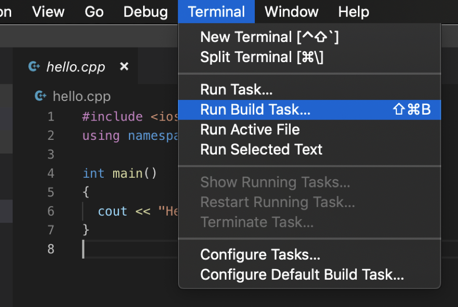

You should see this output:

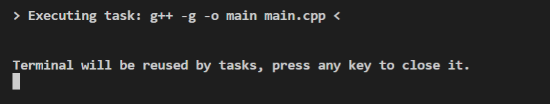

Click anywhere in the terminal to close the message.

New files will be created.

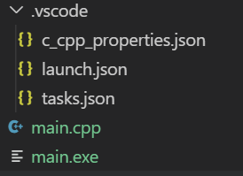

4)	Run the compiled c++ file (.exe)

Powershell:
```
./hello.exe
```
Command Prompt:
```
hello.exe
```

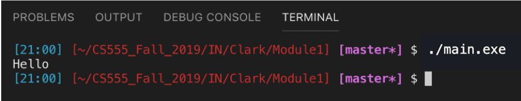


## Workflow

1 -	Copy .vscode and add to your project folder

2 -	Modify `launch.json`. Your program path should be `${workspaceFolder}/yourfilename.out`. Hit save.

3 -	Modify `tasks.json`. Your arguments should include `yourfilename.cpp` and `yourfilename.out`. Hit save.

## Step by Step
- Click `.vscode.zip`
- Click Download
- Choose the location of your project folder

Sample working C++ project directory structure:
```
| hello
|_ .vscode
 |_ c_cpp_properties.json
 |_ launch.json
 |_ tasks.json
|_ hello.cpp
```

Note: You have to have `.vscode` folder and files in every C++ project folder.

## Modifying for Project Use
- To easily use this, just replace `filename` with your own, i.e. change to `hello`.
- In `launch.json`:
```
            "program": "${workspaceFolder}/filename.exe"
```
- In `tasks.json`:
```
            "args": [
                "-g",
                "-o",
                "filename",
                "filename.cpp"
```

## Contents of the Files

The following files are included in .vscode:

`c_cpp_properties.json`

```
{
    "configurations": [
        {
            "name": "Win32",
            "includePath": [
                "${workspaceFolder}/**"
            ],
            "defines": [
                "_DEBUG",
                "UNICODE",
                "_UNICODE"
            ],
            "intelliSenseMode": "gcc-x64",
            "compilerPath": "C:\\mingw-w64\\i686-8.1.0-posix-dwarf-rt_v6-rev0\\mingw32\\bin\\g++.exe"
        }
    ],
    "version": 4
}
```

`launch.json`

```
{
    "version": "0.2.0",
    "configurations": [
        {
            "name": "(gdb) Launch",
            "type": "cppdbg",
            "request": "launch",
            "program": "${workspaceFolder}/filename.exe",
            "args": [],
            "stopAtEntry": true,
            "cwd": "${workspaceFolder}",
            "environment": [],
            "externalConsole": true,
            "MIMode": "gdb",
            "miDebuggerPath": "C:\\mingw-w64\\i686-8.1.0-posix-dwarf-rt_v6-rev0\\mingw32\\bin\\gdb.exe",
            "setupCommands": [
                {
                    "description": "Enable pretty-printing for gdb",
                    "text": "-enable-pretty-printing",
                    "ignoreFailures": true
                }
            ]
        }
    ]
}
```

`tasks.json`

```
{
    "version": "2.0.0",
    "tasks": [
        {
            "label": "build hello world",
            "type": "shell",
            "command": "g++",
            "args": [
                "-g",
                "-o",
                "filename",
                "filename.cpp"
            ],
            "group": {
                "kind": "build",
                "isDefault": true
            }
        }
    ]
}
```
